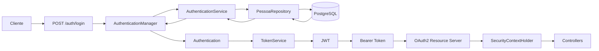

<h1 align="center">
JWT Nimbus JOSE
</h1>

<p align="center">
Boilerplate para construção de APIs REST seguras utilizando <b>Spring Boot 3</b>, <b>Spring Security</b>, <b>OAuth2 Resource Server</b> e <b>Nimbus JOSE + JWT</b>.
</p>

<p align="center">


</p>

---

# 📖 Sobre o projeto

Este projeto foi criado com o objetivo de demonstrar, passo a passo, a implementação de autenticação utilizando **JWT assinado com RSA**, empregando os recursos disponibilizados pelo **Spring Security** e pelo **OAuth2 Resource Server**.

Diferente de um simples boilerplate, este repositório possui uma documentação completa explicando cada etapa da implementação, desde a configuração inicial até a validação do Token JWT.

---

# 🎯 Objetivos

Durante o desenvolvimento serão abordados temas como:

- Configuração do Spring Security
- OAuth2 Resource Server
- Geração de chaves RSA
- Autenticação utilizando `AuthenticationManager`
- Implementação de `UserDetails`
- Implementação de `UserDetailsService`
- Geração de Tokens JWT
- Security Context
- Controle de acesso baseado em Roles
- Testes utilizando Bruno

---

# 🚀 Tecnologias

- Java 17
- Spring Boot 3
- Spring Security
- OAuth2 Resource Server
- Nimbus JOSE + JWT
- Spring Data JPA
- PostgreSQL
- MapStruct
- Lombok
- Maven
- JUnit 5
- Mockito
- Testcontainers

---

# 📚 Documentação

Toda a implementação foi organizada em capítulos.

Cada capítulo representa uma etapa da construção da aplicação.

| Capítulo | Conteúdo |
|----------|----------|
| 📦 | [01 - Instalação](docs/01-instalacao.md) |
| 🏗️ | [02 - Projeto Base](docs/02-projeto-base.md) |
| 🔑 | [03 - Gerando Chaves RSA](docs/03-gerando-chaves-rsa.md) |
| 🛡️ | [04 - Configurando Spring Security](docs/04-configurando-spring-security.md) |
| 👤 | [05 - Integrando ao Spring Security](docs/05-autenticando.md) |
| 🔐 | [06 - Implementando o Login e Gerando o JWT](docs/06-login.md) |
| 🔒 | [07 - Security Context](docs/07-security-context.md) |
| 🧪 | [08 - Validando a Aplicação com Bruno](docs/08-testes.md) |

---

# 🗺️ Fluxo da documentação

```text
Instalação
      │
      ▼
Projeto Base
      │
      ▼
Gerando Chaves RSA
      │
      ▼
Spring Security
      │
      ▼
Authentication
      │
      ▼
Login + JWT
      │
      ▼
Security Context
      │
      ▼
Testes com Bruno
```

---

# 🏛️ Arquitetura da aplicação



---

# 🗃️ Modelo Relacional

<p align="center">
    
</p>

---

# 📂 Estrutura do Projeto

```text
src
├── config
│   ├── rsa
│   └── security
├── controller
├── dto
├── mapper
├── model
├── repository
├── service
│   ├── authentication
│   ├── aviso
│   └── pessoa
├── exception
└── test
```

---

# 🌿 Branches

Este repositório possui duas branches principais.

## projeto-base

Contém toda a estrutura inicial da aplicação com:

- Arquitetura em camadas
- CRUD de Pessoas
- CRUD de Avisos
- DTOs
- Mappers
- Tratamento de exceções
- Spring Security básico

Essa branch serve como ponto de partida para acompanhar a documentação.

---

## main

Contém a implementação completa apresentada nos capítulos deste tutorial.

Incluindo:

- JWT
- OAuth2 Resource Server
- Nimbus JOSE
- RSA
- AuthenticationManager
- UserDetails
- UserDetailsService
- SecurityContextHolder
- Controle por Roles

---

# 🛣️ Roadmap

- [x] CRUD Pessoa
- [x] CRUD Aviso
- [x] DTOs
- [x] MapStruct
- [x] Spring Security
- [x] JWT
- [x] Nimbus JOSE
- [x] OAuth2 Resource Server
- [x] Controle por Roles
- [x] Security Context
- [x] Documentação completa

---

# 🤝 Contribuindo

Contribuições são sempre bem-vindas.

Caso encontre algum problema ou tenha sugestões de melhoria, fique à vontade para abrir uma **Issue** ou enviar um **Pull Request**.

---

# 👨‍💻 Autor

**Igo Marcelino**

Backend Java Developer

GitHub: https://github.com/igomarcelino

---

⭐ Se este projeto foi útil para você, considere deixar uma estrela no repositório!