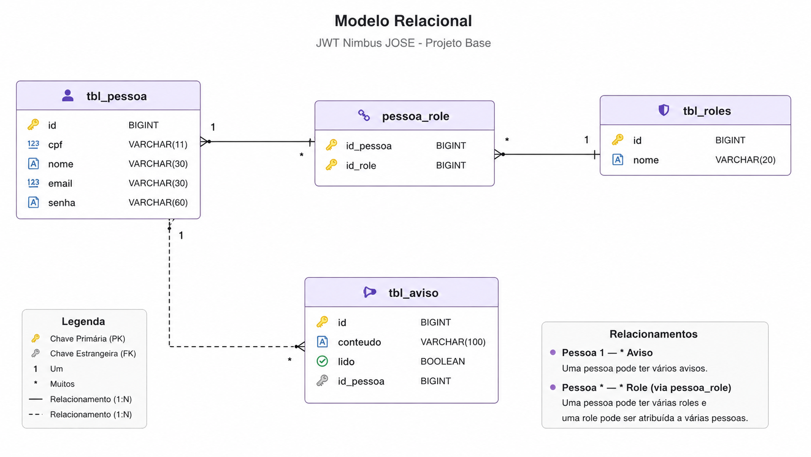

<p align="center">

🏠 <a href="../README.md">Início</a> •
➡️ <a href="02-projeto-base.md">Próximo Capítulo</a>

</p>

---
# Capítulo 1 - Instalação e Preparação do Ambiente

> Neste capítulo iremos preparar todo o ambiente de desenvolvimento para acompanhar o restante do tutorial. Ao final desta etapa você terá a aplicação executando localmente e conhecerá a estrutura utilizada durante todo o projeto.

---

# Sobre o Projeto

O **JWT Nimbus JOSE** é um boilerplate desenvolvido utilizando **Spring Boot 3** com o objetivo de demonstrar, de forma prática, a implementação de autenticação baseada em **JWT** utilizando **Spring Security**, **OAuth2 Resource Server** e **Nimbus JOSE**.

Mais do que uma API de exemplo, este repositório foi estruturado como um guia de estudos. Durante os próximos capítulos construiremos toda a camada de autenticação passo a passo, compreendendo o papel de cada componente envolvido no processo.

Todo o desenvolvimento seguirá boas práticas de arquitetura em camadas, organização de código, testes e separação de responsabilidades.

---

# Como este projeto foi organizado

Para facilitar o aprendizado, o projeto foi dividido em duas branches.

## Branch `projetobase`

Esta branch contém uma API REST completamente funcional, porém utilizando apenas uma configuração básica do Spring Security.

Ela será utilizada como ponto de partida durante todo o tutorial.

Nela já estão implementados:

- Arquitetura em camadas
- Spring Data JPA
- PostgreSQL
- DTOs
- MapStruct
- Validação de dados
- Tratamento global de exceções
- CRUD de Pessoas
- CRUD de Avisos
- Controle de Roles
- Testes Unitários
- Testes de Integração

O objetivo desta branch é permitir que o foco do tutorial seja exclusivamente a implementação da autenticação JWT.

---

## Branch `main`

A branch principal representa o resultado final do projeto.

Ao longo da documentação ela receberá as seguintes implementações:

- Spring Security
- OAuth2 Resource Server
- Nimbus JOSE
- JWT
- Login
- Controle de Autorização
- SecurityContextHolder
- Refresh Token (Roadmap)

---

# Tecnologias Utilizadas

O projeto foi desenvolvido utilizando as seguintes tecnologias.

| Tecnologia | Finalidade |
|------------|------------|
| Java 17 | Linguagem principal |
| Spring Boot 3 | Framework da aplicação |
| Spring Security | Segurança |
| OAuth2 Resource Server | Validação do JWT |
| Nimbus JOSE | Assinatura e geração do JWT |
| Spring Data JPA | Persistência |
| PostgreSQL | Banco de dados |
| MapStruct | Conversão entre Entidades e DTOs |
| Lombok | Redução de código boilerplate |
| JUnit 5 | Testes Unitários |
| Mockito | Mock de dependências |
| Testcontainers | Testes de Integração |

---

# Pré-requisitos

Antes de iniciar, certifique-se de possuir instalado em sua máquina:

| Software | Versão Recomendada |
|-----------|--------------------|
| Java | 17 |
| Maven | 3.9+ |
| PostgreSQL | 15+ |
| Git | Última versão |
| IntelliJ IDEA (ou STS) | Última versão |

---

# Clonando o Projeto

Clone o repositório.

```bash
git clone https://github.com/igomarcelino/jwt-nimbus-jose.git
```

Entre na pasta do projeto.

```bash
cd jwt-nimbus-jose
```

---

# Selecionando a Branch

Todo este tutorial utiliza a branch **projetobase**.

```bash
git checkout projetobase
```

A partir dela construiremos toda a camada de autenticação.

---

# Configurando o Banco de Dados

Crie um banco chamado:

```sql
CREATE DATABASE jwt_nimbus;
```
Crie as seguintes tabelas
```sql
CREATE TABLE tbl_pessoa (
    id BIGSERIAL PRIMARY KEY,
    nome VARCHAR(30) NOT NULL,
    cpf VARCHAR(11) NOT NULL UNIQUE,
    email VARCHAR(30) NOT NULL UNIQUE,
    senha VARCHAR(60) NOT NULL
);

CREATE TABLE tbl_roles (
    id BIGSERIAL PRIMARY KEY,
    nome VARCHAR(20) NOT NULL UNIQUE
);

CREATE TABLE pessoa_role (
    id_pessoa BIGINT NOT NULL,
    id_role BIGINT NOT NULL,
    PRIMARY KEY (id_pessoa, id_role),
    CONSTRAINT fk_pessoa
        FOREIGN KEY (id_pessoa)
        REFERENCES tbl_pessoa(id),
    CONSTRAINT fk_role
        FOREIGN KEY (id_role)
        REFERENCES tbl_roles(id)
);

CREATE TABLE tbl_aviso (
    id BIGSERIAL PRIMARY KEY,
    conteudo VARCHAR(100) NOT NULL,
    lido BOOLEAN NOT NULL,
    id_pessoa BIGINT NOT NULL,
    CONSTRAINT fk_aviso_pessoa
        FOREIGN KEY (id_pessoa)
        REFERENCES tbl_pessoa(id)
);
```

Configure o arquivo `application.properties`.

```properties
spring.datasource.url=jdbc:postgresql://localhost:5432/jwt_nimbus
spring.datasource.username=postgres
spring.datasource.password=sua_senha

spring.jpa.hibernate.ddl-auto=update
spring.jpa.show-sql=true
```

> **Observação**
>
> Durante este tutorial utilizaremos `spring.jpa.hibernate.ddl-auto=update` para simplificar a configuração inicial.
>
> Em aplicações de produção é recomendado utilizar ferramentas como **Flyway** ou **Liquibase** para versionamento do banco de dados.

---

# Modelo Relacional

O projeto foi modelado utilizando quatro tabelas principais.

- **Pessoa** → usuários do sistema.
- **Roles** → perfis de acesso.
- **Pessoa_Role** → associação entre usuários e perfis.
- **Aviso** → mensagens cadastradas pelos usuários.

A estrutura pode ser visualizada abaixo.



---

# Estrutura das Tabelas

| Tabela | Responsabilidade |
|---------|------------------|
| tbl_pessoa | Cadastro de usuários |
| tbl_roles | Perfis de acesso |
| pessoa_role | Associação Pessoa x Role |
| tbl_aviso | Avisos cadastrados pelos usuários |

---

# Criando as Roles

Durante o tutorial utilizaremos duas Roles.

```sql
INSERT INTO tbl_roles(nome) VALUES ('ADMIN');
INSERT INTO tbl_roles(nome) VALUES ('EDITOR');
INSERT INTO tbl_roles(nome) VALUES ('GUEST');
```

Essas permissões serão utilizadas futuramente durante a geração do JWT.

---

# Instalando as Dependências

Como o projeto utiliza Maven, execute:

```bash
mvn clean install
```

Esse comando realizará o download de todas as dependências do projeto.

---

# Executando a Aplicação

Para iniciar a API execute:

```bash
mvn spring-boot:run
```

Ou execute diretamente a classe principal pela IDE.

Após iniciar, a aplicação estará disponível em:

```
http://localhost:8080
```

---

# Validando a Instalação

Se tudo estiver correto, a aplicação deverá iniciar sem erros e criar automaticamente as tabelas no banco de dados.

Neste momento ainda não iremos testar nenhum endpoint.

Nos próximos capítulos conheceremos toda a arquitetura da aplicação antes de iniciar a implementação da autenticação.

---

# Próximo Capítulo

No próximo capítulo iremos explorar a arquitetura existente na branch **projetobase**, entendendo a responsabilidade de cada camada da aplicação e como ela foi organizada para receber a implementação do JWT.


<p align="center">

🏠 <a href="../README.md">Início</a> •
<a href="02-projeto-base.md">➡️ **Capítulo 2 — Conhecendo o Projeto Base**</a>

</p>

---