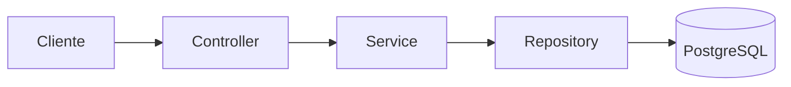

<p align="center">

⬅️ <a href="01-instalacao.md">Anterior</a> •
🏠 <a href="../README.md">Início</a> •
➡️ <a href="03-gerando-chaves-rsa.md">Próximo</a>

</p>

---
#Capítulo 2 - Conhecendo o Projeto Base

> Antes de iniciarmos a implementação da autenticação JWT, é importante compreender a arquitetura utilizada neste projeto.

Ao longo dos próximos capítulos iremos modificar uma aplicação já existente. Por esse motivo, conhecer a estrutura inicial facilitará bastante o entendimento das alterações que serão realizadas.

---

# Objetivo deste capítulo

Ao final desta etapa você será capaz de:

- compreender a arquitetura da aplicação;
- entender a responsabilidade de cada camada;
- conhecer as entidades do domínio;
- entender o fluxo de uma requisição HTTP;
- compreender a organização dos testes.

---

# Arquitetura do Projeto

O projeto foi desenvolvido seguindo uma arquitetura em camadas (**Layered Architecture**), um padrão amplamente utilizado em aplicações Spring Boot.

Cada camada possui uma única responsabilidade, tornando a aplicação mais organizada, desacoplada e de fácil manutenção.

A estrutura do projeto está organizada da seguinte forma.

```text
src
├── config
├── controller
├── dto
├── exception
├── mapper
├── model
├── repository
├── service
└── test
```

---

# Organização das Camadas

## Config

Contém todas as configurações da aplicação.

Exemplos:

- Spring Security
- Beans
- Configurações do JWT (nos próximos capítulos)

---

## Controller

Responsável por receber as requisições HTTP.

Sua responsabilidade é apenas:

- receber a requisição;
- validar o payload;
- chamar o Service;
- devolver a resposta.

Toda regra de negócio permanece na camada de serviço.

---

## DTO

Os DTOs (Data Transfer Objects) são utilizados para transportar informações entre cliente e servidor.

Eles evitam expor diretamente as entidades JPA.

No projeto utilizamos:

- RequestDTO
- ResponseDTO

---

## Service

É a camada responsável pelas regras de negócio.

Toda decisão da aplicação acontece aqui.

Exemplos:

- cadastrar pessoa;
- atualizar aviso;
- validar informações;
- consultar banco de dados.

---

## Repository

Camada responsável pela comunicação com o banco de dados utilizando Spring Data JPA.

Cada entidade possui seu próprio Repository.

---

## Mapper

Os mappers utilizam MapStruct para converter automaticamente:

Entity → DTO

DTO → Entity

Eliminando grande parte do código repetitivo.

---

## Model

Representa as entidades persistidas no banco.

Nesta etapa possuímos:

- Pessoa
- Roles
- Aviso

---

## Exception

Contém o tratamento global de exceções da aplicação.

Isso permite que todas as respostas de erro sejam padronizadas.

---

# Fluxo de uma Requisição

Toda requisição segue o fluxo abaixo.

```text
Cliente

↓

Controller

↓

Service

↓

Repository

↓

Banco de Dados

↓

Repository

↓

Service

↓

Controller

↓

Cliente
```

Nos próximos capítulos iremos adicionar uma nova etapa antes do Controller:

Spring Security.

---

# Entidades do Projeto

O domínio da aplicação é composto por três entidades.

## Pessoa

Representa os usuários cadastrados na aplicação.

Principais atributos:

- Nome
- CPF
- Email
- Senha

Cada pessoa pode possuir uma ou mais Roles.

---

## Roles

Define as permissões do usuário.

Exemplos:

ADMIN

EDITOR

GUEST

---

## Aviso

Representa mensagens cadastradas por um usuário.

Cada aviso pertence a uma única Pessoa.

---


---

# Fluxo Atual da Aplicação

Neste momento o projeto possui o seguinte fluxo.

```text
Cliente

↓

Controller

↓

Service

↓

Repository

↓

Banco de Dados
```




Observe que ainda não existe nenhuma camada responsável por autenticação.

Essa será justamente a implementação realizada durante os próximos capítulos.

---

# Organização dos Testes

O projeto separa os testes em duas categorias.

## Testes Unitários

Responsáveis por validar apenas as regras de negócio.

Ferramentas utilizadas:

- JUnit 5
- Mockito

---

## Testes de Integração

Responsáveis por validar a integração entre a aplicação e o banco de dados.

Ferramentas utilizadas:

- Spring Boot Test
- Testcontainers

---

# O que será implementado a partir daqui

Nos próximos capítulos adicionaremos gradualmente uma nova camada responsável pela segurança da aplicação.

Ela será composta por:

- OAuth2 Resource Server
- Nimbus JOSE
- JWT
- Login
- Controle de Roles
- SecurityContextHolder

Ao final do tutorial teremos a seguinte arquitetura.

```text
Cliente

↓

Spring Security

↓

Controller

↓

Service

↓

Repository

↓

Banco de Dados
```

---

# Próximo Capítulo

Agora que conhecemos toda a arquitetura da aplicação, podemos iniciar a implementação da autenticação.

No próximo capítulo iremos gerar o par de chaves RSA que será utilizado para assinar e validar nossos JWTs.


---

<p align="center">

⬅️ <a href="01-instalacao.md">Anterior</a> •
🏠 <a href="../README.md">Início</a> •
<a href="03-gerando-chaves-rsa.md">➡️ Capítulo 3 — Gerando as Chaves RSA</a>

</p>