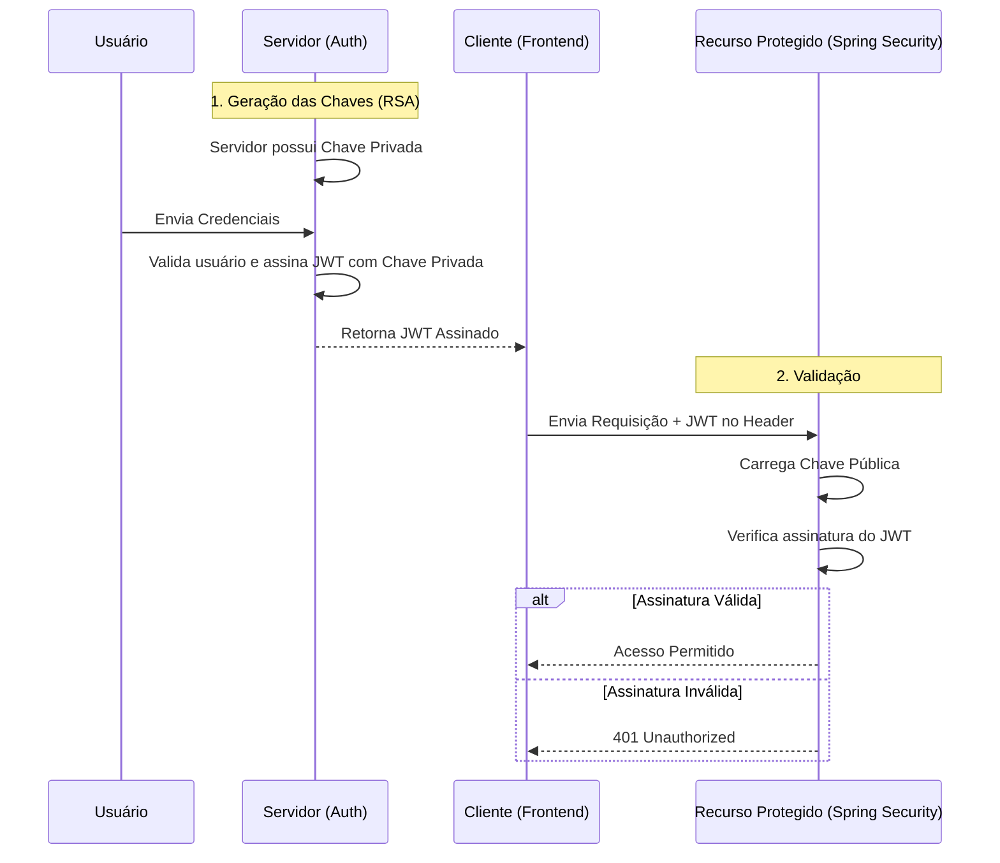

<p align="center">

⬅️ <a href="02-projeto-base.md">Anterior</a> •
🏠 <a href="../README.md">Início</a> •
➡️ <a href="04-configurando-spring-security.md">Próximo</a>

</p>
# Capítulo 3 - Preparando a Infraestrutura de Segurança

> Neste capítulo iremos preparar toda a infraestrutura necessária para que a aplicação possa gerar e validar Tokens JWT utilizando criptografia RSA.

Ao final desta etapa teremos o projeto preparado para trabalhar com o OAuth2 Resource Server do Spring Security.

---

# Objetivo

Antes de gerar nosso primeiro JWT precisamos criar um par de chaves RSA.

Essas chaves serão responsáveis por:

- assinar digitalmente os tokens;
- validar a autenticidade dos tokens recebidos;
- impedir alterações no conteúdo do JWT.

---

# Entendendo a Criptografia Assimétrica

O JWT pode ser assinado utilizando diferentes algoritmos.

Neste projeto utilizaremos **RSA**, que pertence à família da criptografia assimétrica.

Esse modelo utiliza duas chaves diferentes:

- Chave Privada
- Chave Pública

Cada uma possui uma responsabilidade específica.

---

## Chave Privada

A chave privada permanece apenas no servidor.

Ela será utilizada exclusivamente para assinar os JWTs gerados pela aplicação.

Ela nunca deve ser compartilhada.

---

## Chave Pública

A chave pública pode ser distribuída.

Sua função é apenas verificar se um token realmente foi assinado pela chave privada correspondente.

Ela nunca consegue gerar novos tokens.

---

# Fluxo da Assinatura


> Durante todo o projeto manteremos nossas chaves dentro da pasta `resources/certs`.

---

## Gerando a chave privada

Abra um terminal dentro da pasta `certs`.

Execute:

```bash
openssl genpkey \
-algorithm RSA \
-out private.pem \
-pkeyopt rsa_keygen_bits:2048
```

Após executar o comando será criado:

```text
private.pem
```

---

## Gerando a chave pública

Agora execute:

```bash
openssl rsa \
-pubout \
-in private.pem \
-out public.pem
```

O resultado será:

```text
certs
├── private.pem
└── public.pem
```

---

# Entendendo os Arquivos

## private.pem

Responsável por assinar nossos JWTs.

Essa chave nunca deve sair do servidor.

---

## public.pem

Responsável apenas por validar os JWTs.

Ela será utilizada pelo OAuth2 Resource Server.

---

# Importando as Chaves para o Spring

Agora precisamos ensinar o Spring Boot a localizar essas chaves.

Para isso criaremos a classe:

```text
config
└── rsa
    └── RsaKeyProperties.java
```

```java
@ConfigurationProperties(prefix = "rsa")
public record RsaKeyProperties(
        RSAPublicKey publicKey,
        RSAPrivateKey privateKey
) {
}
```

Essa classe será responsável por mapear automaticamente as propriedades configuradas no arquivo `application.properties`.

---

# Configurando o application.properties

Adicione:

```properties
rsa.private-key=classpath:certs/private.pem
rsa.public-key=classpath:certs/public.pem
```

Quando a aplicação iniciar, o Spring carregará automaticamente ambas as chaves.

---

# Habilitando o carregamento das propriedades

Na classe principal da aplicação adicione:

```java
@EnableConfigurationProperties(RsaKeyProperties.class)
```

Essa anotação informa ao Spring que a classe `RsaKeyProperties` deverá ser registrada como um Bean da aplicação.

---

# O que construímos até aqui?

Neste capítulo:

- criamos um par de chaves RSA;
- aprendemos a diferença entre chave pública e privada;
- configuramos o Spring para carregar automaticamente essas chaves;
- preparamos a infraestrutura necessária para geração de JWT.

Observe que ainda não geramos nenhum Token.

Nosso próximo passo será configurar o Spring Security para utilizar essas chaves.

---

# Próximo Capítulo

Agora que a infraestrutura está pronta, iremos configurar o Spring Security para utilizar o OAuth2 Resource Server e preparar a aplicação para gerar e validar Tokens JWT.


<p align="center">

⬅️ <a href="02-projeto-base.md">Anterior</a> •
🏠 <a href="../README.md">Início</a> •
<a href="04-configurando-spring-security.md">➡️ **Capítulo 4 — Configurando o Spring Security**</a>

</p>