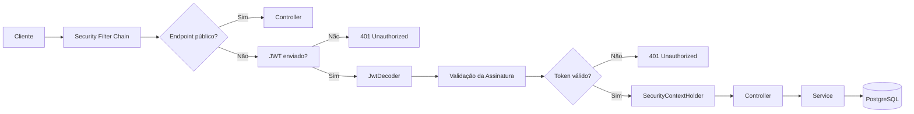

<p align="center">

⬅️ <a href="03-gerando-chaves-rsa.md">Anterior</a> •
🏠 <a href="../README.md">Início</a> •
➡️ <a href="05-autenticando.md">Próximo</a>

</p>
# Capítulo 4 - Configurando o Spring Security e o OAuth2 Resource Server

> Neste capítulo iremos integrar o Spring Security à aplicação, configurar o OAuth2 Resource Server e registrar todos os componentes responsáveis pela autenticação baseada em JWT.

---

# O que você aprenderá

Ao final deste capítulo você será capaz de:

- Compreender o papel da classe `SecurityConfig`;
- Carregar automaticamente as chaves RSA;
- Configurar a `SecurityFilterChain`;
- Registrar os principais Beans do Spring Security;
- Entender como o Spring valida um JWT automaticamente.

---

# Antes de começar

No capítulo anterior geramos nosso par de chaves RSA.

```
private.pem
public.pem
```

Essas chaves já estão armazenadas em:

```text
src
└── main
    └── resources
        └── certs
```

Agora precisamos ensinar o Spring Boot a carregá-las automaticamente.

---

# Criando a classe `RsaKeyProperties`

Crie o pacote:

```text
config
└── rsa
    └── RsaKeyProperties.java
```

```java
package com.github.igomarcelino.jwt_nimbus_jose.config.rsa;

import org.springframework.boot.context.properties.ConfigurationProperties;

import java.security.interfaces.RSAPrivateKey;
import java.security.interfaces.RSAPublicKey;

@ConfigurationProperties(prefix = "rsa")
public record RsaKeyProperties(

        RSAPublicKey publicKey,
        RSAPrivateKey privateKey

) {
}
```

---

## O que é `@ConfigurationProperties`?

A anotação `@ConfigurationProperties` permite mapear automaticamente propriedades do arquivo `application.properties` para um objeto Java.

No nosso caso, o Spring irá procurar todas as propriedades iniciadas por:

```properties
rsa
```

Como:

```properties
rsa.public-key=classpath:certs/public.pem
rsa.private-key=classpath:certs/private.pem
```

Durante a inicialização da aplicação essas propriedades serão convertidas automaticamente em objetos dos tipos:

- `RSAPublicKey`
- `RSAPrivateKey`

Sem que seja necessário carregar manualmente os arquivos `.pem`.

---

# Criando a classe `SecurityConfig`

Toda a configuração de segurança da aplicação ficará centralizada nesta classe.

```java
@Configuration
@EnableWebSecurity
@EnableMethodSecurity
public class SecurityConfig {
```

---

# Entendendo as anotações

## `@Configuration`

Indica que esta classe contém configurações da aplicação.

Todos os métodos anotados com `@Bean` serão executados pelo Spring durante a inicialização e seus objetos ficarão disponíveis para injeção de dependência.

---

## `@EnableWebSecurity`

Ativa toda a infraestrutura do Spring Security.

A partir dessa anotação todas as requisições HTTP passam primeiro pela cadeia de filtros (`Security Filter Chain`) antes de chegarem aos Controllers.

---

## `@EnableMethodSecurity`

Habilita segurança baseada em anotações.

Isso permitirá utilizar recursos como:

```java
@PreAuthorize("hasRole('ADMIN')")
```

ou

```java
@PreAuthorize("hasAuthority('SCOPE_ADMIN')")
```

Embora ainda não utilizemos essas anotações, elas serão muito importantes em capítulos futuros.

---

# Injetando as chaves RSA

Como `RsaKeyProperties` foi registrada pelo Spring, podemos utilizá-la normalmente através da injeção de dependência.

```java
private final RsaKeyProperties rsaKeys;

public SecurityConfig(RsaKeyProperties rsaKeys) {
    this.rsaKeys = rsaKeys;
}
```

A partir desse momento teremos acesso às duas chaves da aplicação.

```java
rsaKeys.publicKey();

rsaKeys.privateKey();
```

Essas chaves serão utilizadas pelos Beans responsáveis por gerar e validar nossos JWTs.

---

# Configurando a Security Filter Chain

O primeiro Bean da nossa configuração será a `SecurityFilterChain`.

```java
@Bean
public SecurityFilterChain securityFilterChain(HttpSecurity http) throws Exception {

    http.authorizeHttpRequests(authz ->
                    authz.requestMatchers("/auth/login/**","/pessoa/user-admin/**").permitAll()
                            .anyRequest().authenticated())
            .headers(headers ->
                    headers.frameOptions(HeadersConfigurer.FrameOptionsConfig::sameOrigin))
            .csrf(CsrfConfigurer::disable)
            .cors(Customizer.withDefaults())
            .oauth2ResourceServer(oauth2 ->
                    oauth2.jwt(Customizer.withDefaults()))
            .sessionManagement(session ->
                    session.sessionCreationPolicy(SessionCreationPolicy.STATELESS));

    return http.build();
}
```

Essa configuração representa toda a política de segurança da aplicação.

---

# Permitindo acesso ao Login

```java
.requestMatchers("/auth/login/**").permitAll()
```

O endpoint responsável pelo login precisa permanecer público, pois o usuário ainda não possui um JWT.

Todos os demais endpoints serão protegidos.

```java
.anyRequest().authenticated()
```

Essa abordagem garante que qualquer novo endpoint criado futuramente já nasça protegido.

---

# Configurando os Headers HTTP

```java
.headers(headers ->
        headers.frameOptions(HeadersConfigurer.FrameOptionsConfig::sameOrigin))
```

Essa configuração define a política de utilização de **Frames**.

Ela permite que páginas da própria aplicação sejam carregadas dentro de um `<iframe>`.

Embora este projeto utilize PostgreSQL, essa configuração é bastante comum em aplicações que utilizam ferramentas como o H2 Console.

---

# Desabilitando o CSRF

```java
.csrf(CsrfConfigurer::disable)
```

Como nossa aplicação será **Stateless**, utilizando JWT em vez de sessões HTTP, não precisamos da proteção contra CSRF.

> **Importante**
>
> Essa configuração é recomendada apenas para APIs REST autenticadas por Token.

---

# Configurando o CORS

```java
.cors(Customizer.withDefaults())
```

Essa configuração habilita o mecanismo de CORS do Spring Security.

As regras serão definidas através do Bean `CorsConfigurationSource`.

---

# Registrando o Bean `CorsConfigurationSource`

```java
@Bean
public CorsConfigurationSource corsConfigurationSource() {

    CorsConfiguration config = new CorsConfiguration();

    config.setAllowedOrigins(List.of(
            "http://localhost:5173",
            "http://localhost:4173"
    ));

    config.setAllowedMethods(List.of(
            "GET",
            "POST",
            "PUT",
            "PATCH",
            "DELETE",
            "OPTIONS"
    ));

    config.setAllowedHeaders(List.of(
            "Authorization",
            "Content-Type"
    ));

    config.setAllowCredentials(true);

    UrlBasedCorsConfigurationSource source =
            new UrlBasedCorsConfigurationSource();

    source.registerCorsConfiguration("/**", config);

    return source;
}
```

Esse Bean define quais aplicações poderão consumir nossa API.

No exemplo acima permitimos requisições provenientes de aplicações Vue.js executando localmente.

---

# OAuth2 Resource Server

```java
.oauth2ResourceServer(oauth2 ->
        oauth2.jwt(Customizer.withDefaults()))
```

Essa configuração informa ao Spring Security que os tokens utilizados pela aplicação serão JWT.

Sempre que uma requisição possuir o cabeçalho:

```http
Authorization: Bearer eyJhbGc...
```

o Spring automaticamente:

- localiza o token;
- valida sua assinatura;
- verifica sua integridade;
- extrai seus Claims;
- cria um objeto `Authentication`;
- armazena esse objeto no `SecurityContextHolder`.

Todo esse processo acontece sem que seja necessário escrever código manual para validação.

---

# Tornando a aplicação Stateless

```java
.sessionManagement(session ->
        session.sessionCreationPolicy(SessionCreationPolicy.STATELESS))
```

Ao utilizar JWT não precisamos manter sessões HTTP.

Cada requisição enviada pelo cliente deve conter todas as informações necessárias para autenticação.

Essa configuração informa ao Spring Security para nunca criar ou reutilizar sessões.

---

# Registrando o PasswordEncoder

```java
@Bean
public PasswordEncoder passwordEncoder() {
    return new BCryptPasswordEncoder();
}
```

Esse Bean será responsável por criptografar as senhas utilizando o algoritmo BCrypt.

Além de gerar hashes seguros, o BCrypt aplica automaticamente um **Salt**, aumentando a proteção contra ataques de força bruta.

---

# Registrando o AuthenticationManager

```java
@Bean
public AuthenticationManager authenticationManager(
        AuthenticationConfiguration configuration)
        throws Exception {

    return configuration.getAuthenticationManager();
}
```

O `AuthenticationManager` coordena todo o processo de autenticação.

Quando o usuário realizar login ele será responsável por:

- validar as credenciais;
- localizar o usuário;
- comparar a senha criptografada;
- devolver um objeto `Authentication`.

---

# Registrando o JwtDecoder

```java
@Bean
public JwtDecoder jwtDecoder() {
    return NimbusJwtDecoder
            .withPublicKey(rsaKeys.publicKey())
            .build();
}
```

O `JwtDecoder` será utilizado pelo OAuth2 Resource Server para validar todos os JWTs recebidos pela aplicação.

Observe que utilizamos apenas a chave pública.

---

# Registrando o JwtEncoder

```java
@Bean
public JwtEncoder jwtEncoder() {

    JWK jwk = new RSAKey.Builder(rsaKeys.publicKey())
            .privateKey(rsaKeys.privateKey())
            .build();

    JWKSource<SecurityContext> jwks =
            new ImmutableJWKSet<>(new JWKSet(jwk));

    return new NimbusJwtEncoder(jwks);
}
```

Esse Bean será utilizado futuramente para gerar nossos JWTs.

Ele utiliza:

- a chave privada para assinar o token;
- a chave pública para compor a estrutura JWK utilizada pelo Nimbus JOSE.

---

# Fluxo da autenticação



---

# O que construímos neste capítulo?

Ao final desta etapa nossa aplicação possui:

- Spring Security configurado;
- Security Filter Chain;
- OAuth2 Resource Server;
- PasswordEncoder;
- AuthenticationManager;
- JwtEncoder;
- JwtDecoder;
- Política Stateless;
- Configuração de CORS.

A infraestrutura necessária para autenticação está pronta.

No próximo capítulo iremos implementar o processo de login e gerar nosso primeiro JWT.

---

# Próximo capítulo

Agora que toda a infraestrutura de segurança está configurada, chegou o momento de autenticar o usuário e emitir o primeiro Token JWT.


<p align="center">

⬅️ <a href="03-gerando-chaves-rsa.md">Anterior</a> •
🏠 <a href="../README.md">Início</a> •
<a href="05-autenticando.md">➡️ **Capítulo 5 — Implementando a Autenticação e Gerando o JWT**</a>

</p>