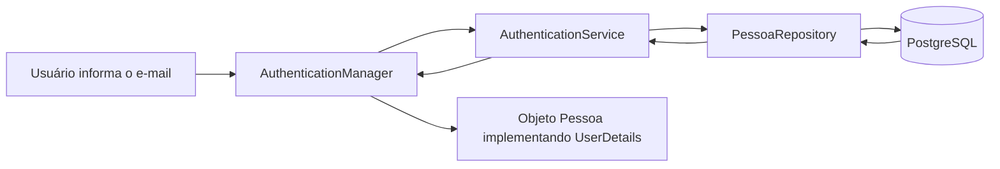

<p align="center">

⬅️ <a href="04-configurando-spring-security.md">Anterior</a> •
🏠 <a href="../README.md">Início</a> •
➡️ <a href="06-login.md">Próximo</a>

</p>
# Capítulo 5 - Integrando a Aplicação ao Spring Security

> Até este momento configuramos toda a infraestrutura de segurança da aplicação. Agora precisamos ensinar ao Spring Security como localizar um usuário no banco de dados e transformá-lo em um usuário autenticável.

---

# O que você aprenderá

Ao final deste capítulo você será capaz de:

- Entender o papel da interface `UserDetails`;
- Adaptar a entidade `Pessoa` para o Spring Security;
- Implementar o método `findByEmail`;
- Criar um `UserDetailsService`;
- Compreender como o Spring localiza um usuário durante o processo de autenticação.

---

# Como o Spring Security encontra um usuário?

Quando um usuário realiza login, o Spring Security precisa localizar suas informações no banco de dados.

Por padrão, ele não conhece a entidade `Pessoa`, nem sabe como consultar o banco.

Por isso precisamos implementar dois componentes importantes:

- `UserDetails`
- `UserDetailsService`

Esses componentes funcionam como uma ponte entre o Spring Security e o nosso modelo de domínio.

---

# O papel da interface UserDetails

A interface `UserDetails` representa um usuário autenticável.

Sempre que o Spring Security precisar autenticar alguém, ele trabalhará com objetos que implementam essa interface.

Em vez de criar uma nova classe apenas para autenticação, podemos adaptar nossa própria entidade `Pessoa`.


---

# Implementando UserDetails

```java
public class Pessoa implements UserDetails {
```

A partir desse momento, a entidade `Pessoa` passa a ser reconhecida pelo Spring Security como um usuário válido.

---

# Implementando getUsername()

```java
@Override
public String getUsername() {
    return this.email;
}
```

O Spring Security utiliza esse método para identificar unicamente um usuário.

Neste projeto optamos por utilizar o e-mail como identificador de login.

Isso significa que, durante a autenticação, o usuário informará seu e-mail e não seu CPF.

---

# Implementando getPassword()

```java
@Override
public String getPassword() {
    return this.senha;
}
```

Esse método retorna a senha criptografada armazenada no banco de dados.

Ela será comparada automaticamente pelo `AuthenticationManager` utilizando o `PasswordEncoder` configurado no capítulo anterior.

---

# Implementando getAuthorities()

```java
@Override
public Collection<? extends GrantedAuthority> getAuthorities() {

    return this.roles.stream()

            .map(role -> new SimpleGrantedAuthority(role.getNome()))

            .collect(Collectors.toSet());

}
```

Esse método converte as Roles da entidade `Pessoa` em objetos do tipo `GrantedAuthority`.

O Spring Security utiliza essas autoridades para controlar o acesso aos recursos da aplicação.

Por exemplo:

```
ADMIN
EDITOR
GUEST
```

Mais adiante essas permissões serão incluídas dentro do JWT.

---

# Métodos de controle da conta

A interface `UserDetails` também define alguns métodos responsáveis por informar a situação da conta do usuário.

```java
isAccountNonExpired()

isAccountNonLocked()

isCredentialsNonExpired()

isEnabled()
```

Neste projeto todos retornam `true`, indicando que:

- a conta nunca expira;
- a conta nunca é bloqueada;
- as credenciais nunca expiram;
- o usuário sempre está ativo.

Em aplicações reais esses métodos podem ser implementados utilizando informações armazenadas no banco de dados.

---

# Localizando usuários pelo e-mail

Agora precisamos ensinar o Repository a localizar um usuário utilizando seu e-mail.

Adicione o método abaixo ao `PessoaRepository`.

```java
Optional<Pessoa> findByEmail(String email);
```

O Spring Data JPA criará automaticamente a consulta necessária com base no nome do método.

Não será necessário escrever nenhuma instrução SQL.

---

# Criando o AuthenticationService

Agora criaremos o componente responsável por entregar usuários ao Spring Security.

```
service
└── authentication
    └── AuthenticationService.java
```

```java
@Service
public class AuthenticationService implements UserDetailsService {

    private final PessoaRepository pessoaRepository;

    public AuthenticationService(PessoaRepository pessoaRepository) {
        this.pessoaRepository = pessoaRepository;
    }

    @Override
    public UserDetails loadUserByUsername(String username)
            throws UsernameNotFoundException {

        return pessoaRepository.findByEmail(username)
                .orElseThrow(() ->
                        new PessoaNotFoundException("Usuário não localizado"));

    }

}
```

---

# O que é UserDetailsService?

O `UserDetailsService` é uma interface fornecida pelo Spring Security.

Sua responsabilidade é localizar um usuário sempre que uma autenticação for iniciada.

Observe que não implementamos nenhuma lógica de autenticação aqui.

Esse serviço apenas consulta o banco de dados e devolve um objeto que implemente `UserDetails`.

No nosso caso, esse objeto é a própria entidade `Pessoa`.

---

# O método loadUserByUsername()

```java
@Override
public UserDetails loadUserByUsername(String username)
```

Apesar do nome do método mencionar *Username*, isso não significa que ele deva utilizar obrigatoriamente um nome de usuário.

O parâmetro representa apenas o identificador utilizado durante a autenticação.

Neste projeto utilizamos o e-mail.

```java
pessoaRepository.findByEmail(username)
```

Caso nenhum usuário seja encontrado, uma exceção será lançada.

```java
throw new PessoaNotFoundException(...)
```

Essa exceção interrompe o processo de autenticação e impede que um usuário inexistente seja autenticado.

---

# Fluxo de carregamento do usuário

Após essas implementações, o processo de localização de um usuário passa a funcionar da seguinte forma.



Observe que ainda não existe nenhuma comparação de senha.

Nosso objetivo neste capítulo foi apenas ensinar ao Spring Security como localizar um usuário no banco de dados.

A autenticação propriamente dita será implementada no próximo capítulo.

---

# O que construímos neste capítulo?

Ao final desta etapa nossa aplicação passou a contar com:

- Entidade `Pessoa` implementando `UserDetails`;
- Conversão automática das Roles em `GrantedAuthority`;
- Consulta de usuários por e-mail;
- Implementação do `UserDetailsService`;
- Integração entre o Spring Security e o banco de dados.

Agora o Spring já sabe como localizar um usuário.

O próximo passo será validar suas credenciais e gerar um Token JWT.

---

# Próximo capítulo

No próximo capítulo implementaremos o processo completo de autenticação, utilizando o `AuthenticationManager` para validar as credenciais do usuário e o `TokenService` para gerar nosso primeiro JWT.


<p align="center">

⬅️ <a href="05-autenticando.md">Anterior</a> •
🏠 <a href="../README.md">Início</a> •
➡️<a href="06-login.md"> **Capítulo 6 — Implementando o Login e Gerando o JWT**</a>

</p>