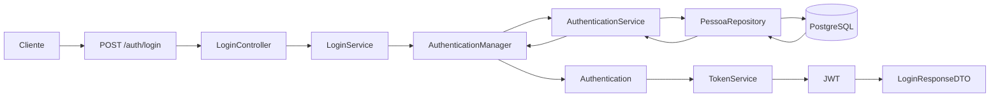
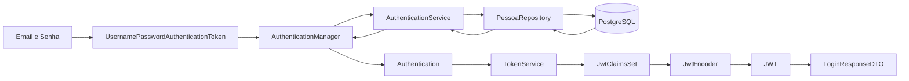

<p align="center">

⬅️ <a href="05-autenticando.md">Anterior</a> •
🏠 <a href="../README.md">Início</a> •
➡️<a href="07-security-context.md"> Proximo</a>

</p>
# Capítulo 6 - Implementando o Login e Gerando o JWT

> Neste capítulo construiremos o processo completo de autenticação da aplicação. Ao final, o usuário poderá informar suas credenciais, ser autenticado pelo Spring Security e receber um Token JWT assinado utilizando nossa chave RSA.

---

# O que você aprenderá

Ao final deste capítulo você será capaz de:

- Criar os DTOs utilizados no login;
- Compreender o papel do `AuthenticationManager`;
- Entender como o Spring Security autentica um usuário;
- Gerar um JWT utilizando o Nimbus JOSE;
- Construir o serviço responsável pela autenticação;
- Retornar o Token JWT para o cliente.

---

# Como funciona o processo de Login?

Antes de escrever qualquer código, vamos entender o fluxo completo da autenticação.



Observe que o Token JWT somente será gerado **após** a autenticação do usuário.

---

# Criando os DTOs

Como qualquer endpoint REST, nosso login receberá uma requisição e devolverá uma resposta.

Para isso criaremos dois DTOs.

Estrutura:

```text
dto
└── login
    ├── LoginRequestDTO.java
    └── LoginResponseDTO.java
```

---

## LoginRequestDTO

```java
package com.github.igomarcelino.jwt_nimbus_jose.dto.login;

public record LoginRequestDTO(

        String email,
        String senha

) {
}
```

Esse DTO representa os dados enviados pelo cliente.

Exemplo:

```json
{
    "email":"igo@email.com",
    "senha":"123456"
}
```

---

## LoginResponseDTO

```java
package com.github.igomarcelino.jwt_nimbus_jose.dto.login;

public record LoginResponseDTO(

        String accessToken

) {
}
```

Após a autenticação, nossa API devolverá apenas o Token JWT.

Exemplo:

```json
{
    "accessToken":"eyJhbGciOiJSUzI1NiJ9..."
}
```

---

# Criando o LoginService

Agora criaremos o serviço responsável por autenticar o usuário.

Estrutura:

```text
service
└── authentication
    └── LoginService.java
```

```java
@Service
public class LoginService {

    private final AuthenticationManager authenticationManager;
    private final TokenService tokenService;
    private final PessoaRepository pessoaRepository;

    public LoginService(AuthenticationManager authenticationManager,
                        TokenService tokenService,
                        PessoaRepository pessoaRepository) {

        this.authenticationManager = authenticationManager;
        this.tokenService = tokenService;
        this.pessoaRepository = pessoaRepository;
    }

    public LoginResponseDTO autenticaUsuario(LoginRequestDTO loginRequestDTO){

        try {

            UsernamePasswordAuthenticationToken authenticationToken =
                    new UsernamePasswordAuthenticationToken(
                            loginRequestDTO.email(),
                            loginRequestDTO.senha());

            Authentication authentication =
                    authenticationManager.authenticate(authenticationToken);

            String token = tokenService.generateToken(authentication);

            return new LoginResponseDTO(token);

        } catch (Exception e){
            throw new AuthenticationCredentialsNotFoundException(e.getMessage());
        }

    }

}
```

---

# Entendendo o LoginService

Observe que esse serviço possui apenas uma responsabilidade:

> Autenticar um usuário e devolver um Token JWT.

Ele não consulta diretamente o banco de dados.

Toda a autenticação será delegada ao Spring Security.

---

# Criando o UsernamePasswordAuthenticationToken

```java
UsernamePasswordAuthenticationToken authenticationToken =
        new UsernamePasswordAuthenticationToken(
                loginRequestDTO.email(),
                loginRequestDTO.senha());
```

Apesar do nome, esse objeto **não autentica** o usuário.

Ele representa apenas as credenciais enviadas pelo cliente.

Neste momento possuímos apenas:

- E-mail
- Senha

Nada foi validado ainda.

---

# AuthenticationManager

A próxima linha inicia efetivamente o processo de autenticação.

```java
Authentication authentication =
        authenticationManager.authenticate(authenticationToken);
```

Essa é uma das chamadas mais importantes de todo o Spring Security.

Ao executar esse método o framework realiza automaticamente:

- Localização do usuário utilizando o `AuthenticationService`;
- Consulta ao banco de dados;
- Comparação da senha utilizando o `PasswordEncoder`;
- Carregamento das Roles;
- Criação do objeto `Authentication`.

Tudo isso acontece automaticamente.

---

# O objeto Authentication

Após uma autenticação bem-sucedida recebemos um objeto do tipo:

```java
Authentication authentication;
```

Esse objeto representa um usuário autenticado.

Ele contém diversas informações importantes, como:

- usuário autenticado;
- authorities (Roles);
- nome do usuário;
- status da autenticação.

Esse objeto será utilizado para gerar nosso JWT.

---

# Criando o TokenService

Agora criaremos o serviço responsável por gerar o Token JWT.

Estrutura:

```text
service
└── authentication
    └── TokenService.java
```

```java
@Service
public class TokenService {

    private final JwtEncoder jwtEncoder;

    public TokenService(JwtEncoder jwtEncoder) {
        this.jwtEncoder = jwtEncoder;
    }

    public String generateToken(Authentication authentication){

        Instant now = Instant.now();

        String scope = authentication.getAuthorities()
                .stream()
                .map(GrantedAuthority::getAuthority)
                .collect(Collectors.joining(" "));

        JwtClaimsSet claimsSet = JwtClaimsSet.builder()
                .issuer("jwt-nimbus")
                .issuedAt(now)
                .expiresAt(now.plus(2, ChronoUnit.HOURS))
                .subject(authentication.getName())
                .claim("scope", scope)
                .build();

        return jwtEncoder
                .encode(JwtEncoderParameters.from(claimsSet))
                .getTokenValue();
    }

}
```

---

# Entendendo o TokenService

Observe que o `TokenService` **não autentica usuários**.

Sua única responsabilidade é transformar um objeto `Authentication` em um Token JWT.

---

# JwtEncoder

```java
private final JwtEncoder jwtEncoder;
```

Esse Bean foi criado no capítulo anterior.

Sua responsabilidade é assinar digitalmente o Token utilizando nossa chave privada RSA.

---

# Criando os Claims

Todo JWT possui um conjunto de informações conhecidas como **Claims**.

Neste projeto utilizaremos:

```java
JwtClaimsSet claimsSet =
        JwtClaimsSet.builder()
```

---

## issuer

```java
.issuer("jwt-nimbus")
```

Identifica qual aplicação gerou o Token.

---

## issuedAt

```java
.issuedAt(now)
```

Data de criação do Token.

---

## expiresAt

```java
.expiresAt(now.plus(2, ChronoUnit.HOURS))
```

Define que o Token será válido por duas horas.

---

## subject

```java
.subject(authentication.getName())
```

O Subject identifica o proprietário do Token.

Neste projeto utilizamos o e-mail do usuário autenticado.

---

## scope

```java
.claim("scope", scope)
```

Armazena as Roles do usuário.

Exemplo:

```
ROLE_ADMIN ROLE_USER
```

Essas permissões serão utilizadas pelo Spring Security para controlar o acesso aos recursos da aplicação.

---

# Assinando o JWT

Após definir todos os Claims, basta solicitar ao Nimbus JOSE a geração do Token.

```java
return jwtEncoder
        .encode(JwtEncoderParameters.from(claimsSet))
        .getTokenValue();
```

Internamente o Nimbus JOSE utilizará:

- a chave privada RSA;
- os Claims definidos;
- o algoritmo RS256.

O resultado será um JWT assinado digitalmente.

---

# Fluxo completo da autenticação



---

# O que construímos neste capítulo?

Ao final desta etapa nossa aplicação passou a ser capaz de:

- Receber credenciais de acesso;
- Autenticar usuários utilizando o Spring Security;
- Validar senhas utilizando o BCrypt;
- Criar um objeto `Authentication`;
- Gerar um JWT assinado utilizando o Nimbus JOSE;
- Retornar o Token para o cliente.

Nosso fluxo de autenticação está completo.

No entanto, ainda falta entender como esse Token será utilizado para acessar os endpoints protegidos da aplicação.

---

# Próximo capítulo

Agora que já conseguimos gerar nosso JWT, chegou o momento de utilizá-lo para acessar recursos protegidos e entender como o Spring Security realiza automaticamente sua validação.


<p align="center">

⬅️ <a href="05-autenticando.md">Anterior</a> •
🏠 <a href="../README.md">Início</a> •
➡️<a href="07-security-context.md"> **Capítulo 7 — Protegendo Endpoints com JWT e OAuth2 Resource Server**</a>

</p>