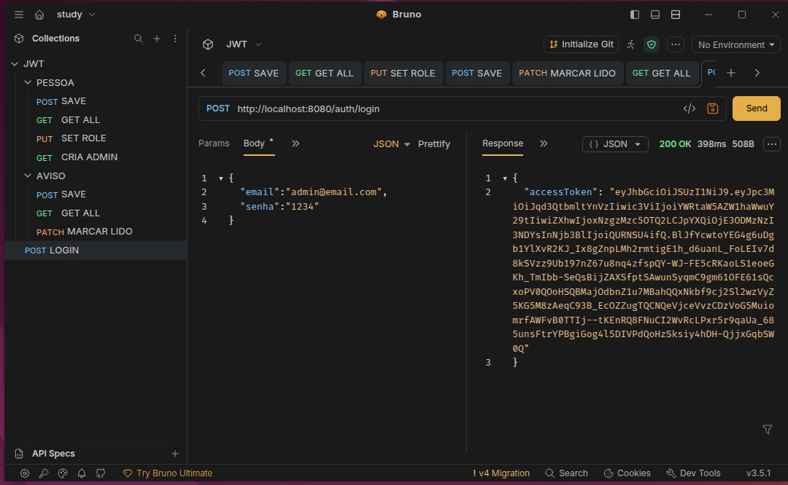
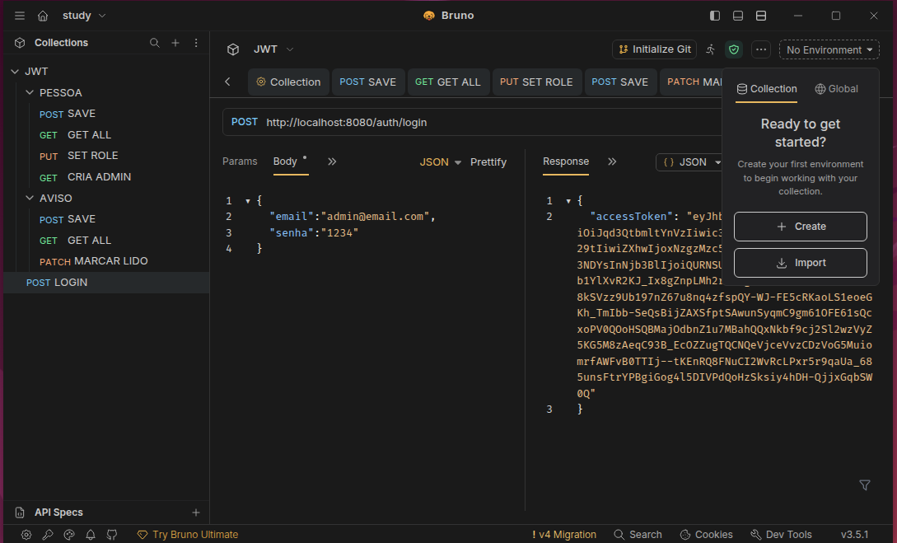
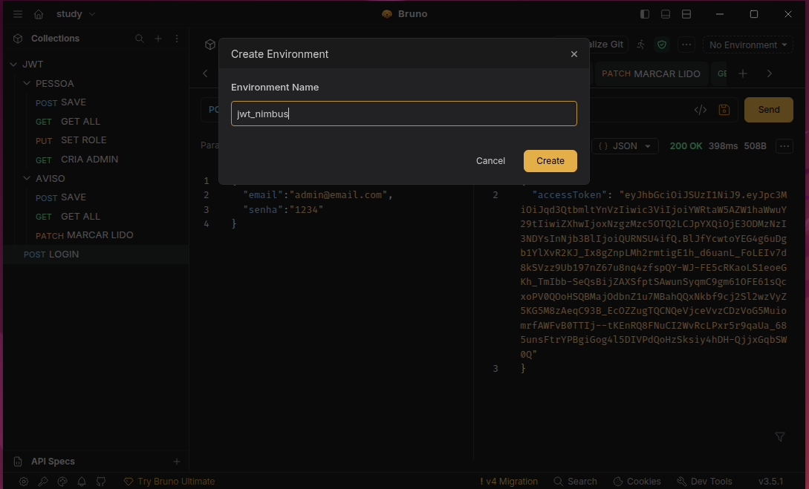
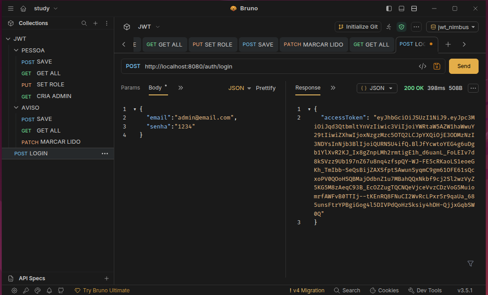
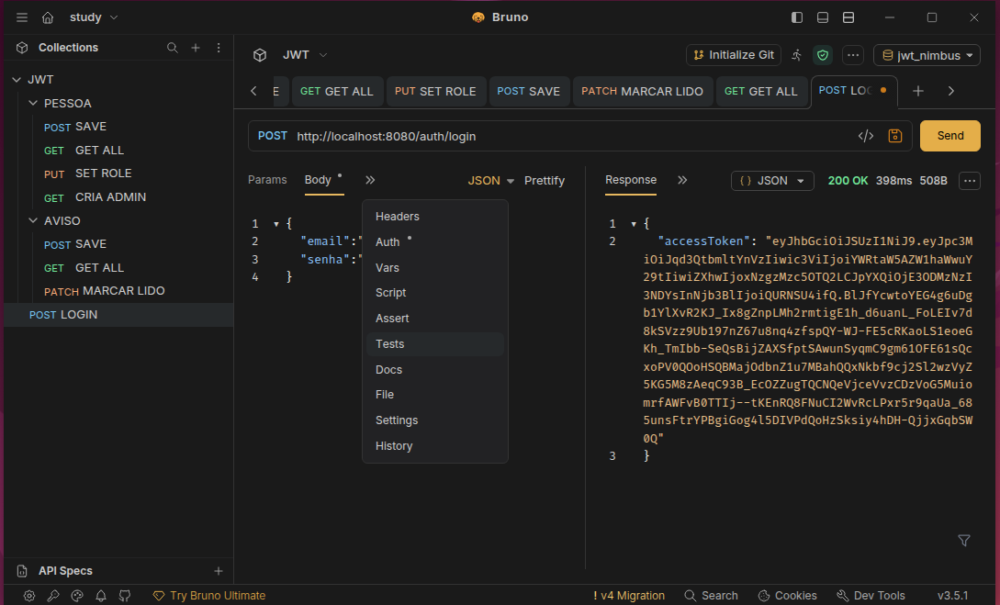
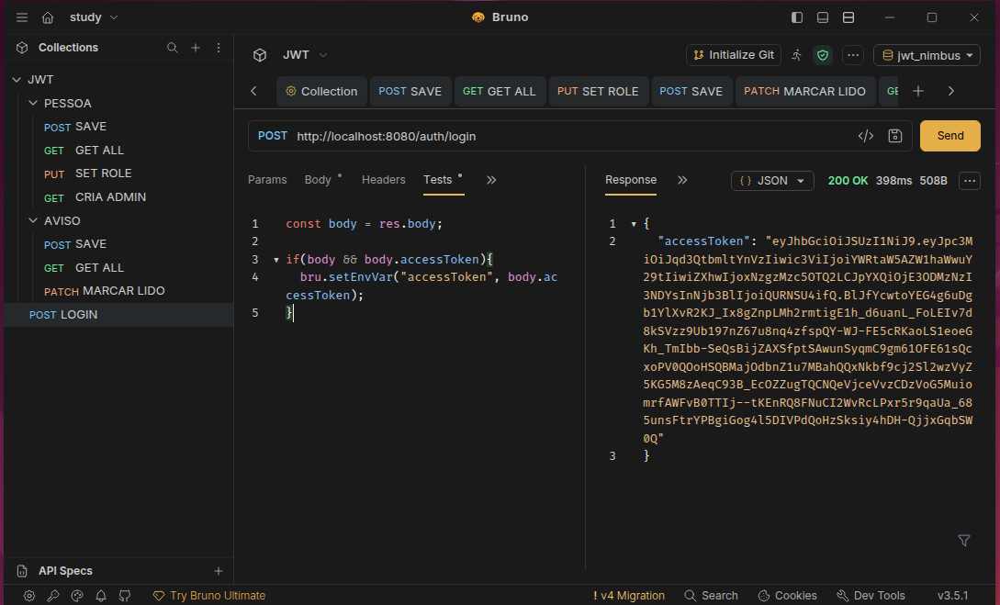
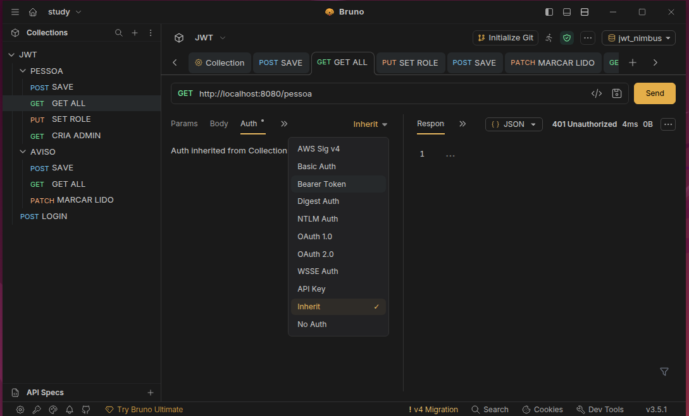
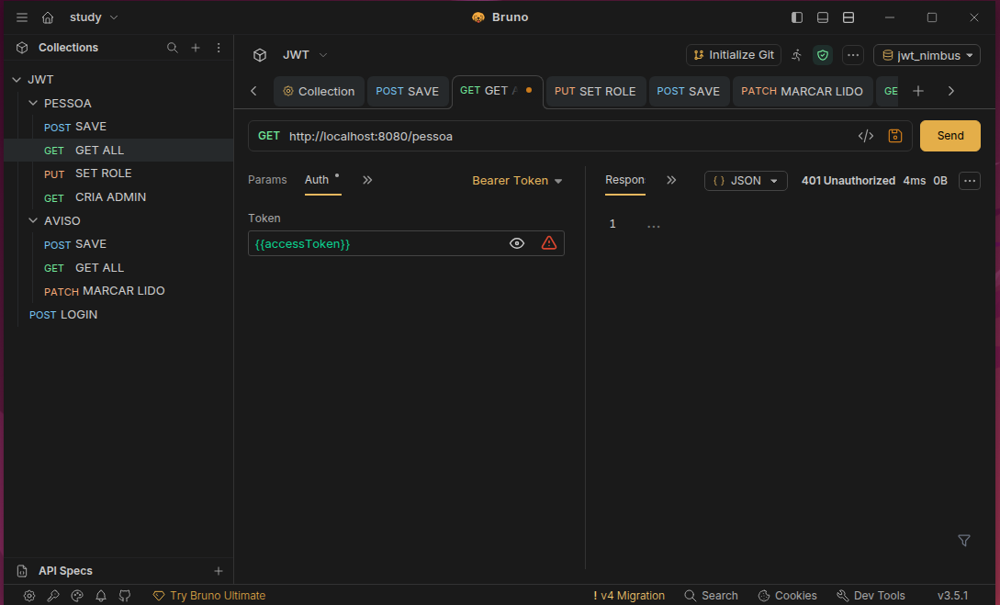

<p align="center">

⬅️ <a href="07-security-context.md">Anterior</a> •
🏠 <a href="../README.md">Início</a> •
</p>
# Capítulo 8 - Validando a Autenticação e a Autorização com Bruno

> Neste capítulo iremos validar toda a infraestrutura construída ao longo do projeto. Utilizaremos o Bruno para gerar um usuário administrador, realizar login, obter um JWT e testar o acesso aos endpoints protegidos da aplicação.

---

# O que você aprenderá

Ao final deste capítulo você será capaz de:

- Criar um usuário administrador;
- Realizar autenticação;
- Obter um JWT;
- Utilizar o Token em requisições autenticadas;
- Compreender a diferença entre autenticação e autorização;
- Validar permissões utilizando Roles.

---

# Antes de começar

Até este momento construímos toda a infraestrutura necessária para autenticação.

Nossa aplicação já possui:

- Spring Security;
- OAuth2 Resource Server;
- JWT;
- AuthenticationManager;
- UserDetailsService;
- SecurityContextHolder;
- Controle de Roles.

Agora iremos validar tudo isso utilizando o Bruno.

---

# Criando um usuário Administrador

Para facilitar os testes, criaremos um endpoint responsável por cadastrar um usuário administrador.

```java
@GetMapping("/user-admin")
public ResponseEntity<Void> criaUsuarioAdmin(){

    pessoaService.criaUsuarioAdmin();

    return ResponseEntity.ok().build();

}
```

Esse endpoint cria automaticamente um usuário contendo a Role **ADMIN**.

Após sua execução, será possível realizar login utilizando esse usuário.

---

# Realizando o Login

Agora utilizaremos o endpoint de autenticação.

```
POST /auth/login
```

Request

```json
{
    "email":"admin@email.com",
    "senha":"1234"
}
```

Resposta

```json
{
    "accessToken":"eyJhbGc..."
}
```

> **Imagem:** Login realizado com sucesso utilizando o Bruno.


<p align="center">
    
</p>


---

# Configurando o Bearer Token

Após obter o JWT, configure o Bruno para enviar o Token em todas as requisições protegidas.

```
Authorization

Bearer Token

{{accessToken}}
```

Dessa forma todas as chamadas utilizarão automaticamente o Token retornado pelo Login.

> **Imagem:** Configuração do Bearer Token.

## Configuração de Autenticação JWT no Bruno

Este fluxo demonstra como automatizar a captura e a utilização do token JWT nas requisições do seu projeto.

### Passo a Passo

## Configuração de Autenticação JWT no Bruno

Este fluxo demonstra como automatizar a captura e a utilização do token JWT nas requisições do seu projeto.

### Passo a Passo

<details>
<summary><b>1. Criando o ambiente</b></summary>

<br>



<br>



</details>

---

<details>
<summary><b>2. Configurando o script para salvar o JWT</b></summary>

<br>



<br>



<br>



</details>

---

<details>
<summary><b>3. Configurando a autenticação da Collection</b></summary>

<br>



<br>



</details>


### Script de Automação
No seu request de `POST LOGIN`, utilize o seguinte script na aba **Tests** para que o token seja capturado automaticamente:

```javascript
const body = res.body;

if(body && body.accessToken){
    bru.setEnvVar("accessToken", body.accessToken);
}

```


# Testando os Endpoints

Agora podemos validar os endpoints protegidos.

## Criando um Aviso

```
POST /aviso
```

Como o usuário possui a Role **ADMIN**, a operação será realizada com sucesso.

> **Imagem:** Cadastro de aviso.


---

## Listando Avisos

```
GET /aviso
```

Esse endpoint está protegido pela anotação:

```java
@PreAuthorize("hasAuthority('SCOPE_ADMIN')")
```

Como estamos autenticados com um usuário administrador, a requisição será autorizada.

> **Imagem:** Listagem de avisos.


---

## Marcando um Aviso como Lido

```
PATCH /aviso/{id}
```

Esse endpoint permite acesso para:

- ADMIN
- EDITOR
- GUEST

```java
@PreAuthorize("""
hasAuthority('SCOPE_ADMIN')
or hasAuthority('SCOPE_EDITOR')
or hasAuthority('SCOPE_GUEST')
""")
```

Como nosso usuário possui a Role **ADMIN**, a operação será realizada normalmente.

> **Imagem:** Atualização do aviso.


---

# Entendendo o @PreAuthorize

Durante o desenvolvimento utilizamos diversas anotações como:

```java
@PreAuthorize("hasAuthority('SCOPE_ADMIN')")
```

Essa anotação é responsável por verificar se o usuário autenticado possui determinada permissão antes da execução do método.

Caso o usuário não possua a autoridade necessária, o Spring Security interrompe a execução e devolve automaticamente:

```
403 Forbidden
```

Observe que nenhuma lógica adicional precisou ser implementada em nossos Controllers.

Todo esse controle é realizado pelo próprio Spring Security.

---

# Como o Spring verifica as Roles?

Durante o Login, o `TokenService` adicionou as Roles do usuário dentro do Claim **scope**.

Exemplo:

```json
{
  "scope":"ADMIN EDITOR"
}
```

Quando o JWT é recebido em uma nova requisição, o OAuth2 Resource Server lê esse Claim e cria automaticamente as autoridades do usuário.

Internamente o Spring converte cada valor para:

```
SCOPE_ADMIN

SCOPE_EDITOR
```

É exatamente por esse motivo que utilizamos:

```java
hasAuthority("SCOPE_ADMIN")
```

---

# Fluxo completo da autorização

```mermaid
flowchart LR

A[Cliente]

-->B[Bearer Token]

-->C[OAuth2 Resource Server]

-->D[JwtDecoder]

-->E[SecurityContextHolder]

-->F[@PreAuthorize]

-->G{Possui a Role?}

G -->|Sim| H[Controller]

G -->|Não| I[403 Forbidden]
```

---

# Autenticação x Autorização

É comum confundir esses dois conceitos.

## Autenticação

Responde à pergunta:

> Quem é o usuário?

Ela acontece durante o Login.

Resultado:

```
JWT
```

---

## Autorização

Responde à pergunta:

> O usuário possui permissão para acessar este recurso?

Ela acontece em todas as requisições protegidas.

Resultado:

```
200 OK

ou

403 Forbidden
```

---

# O que construímos ao longo do projeto?

Ao concluir todos os capítulos anteriores construímos uma API completa utilizando:

- Spring Security;
- OAuth2 Resource Server;
- Nimbus JOSE + JWT;
- Chaves RSA;
- BCrypt;
- UserDetails;
- UserDetailsService;
- AuthenticationManager;
- SecurityContextHolder;
- Controle de acesso baseado em Roles.

Todo o fluxo de autenticação e autorização passou a ser realizado automaticamente pelo Spring Security.

---

# Próximos passos

A partir desta base você poderá evoluir o projeto adicionando novos recursos, como:

- Controle de usuários;
- Cadastro de novas Roles;
- Documentação OpenAPI.


<p align="center">

⬅️ <a href="07-security-context.md">Anterior</a> •
🏠 <a href="../README.md">Início</a> •

</p>